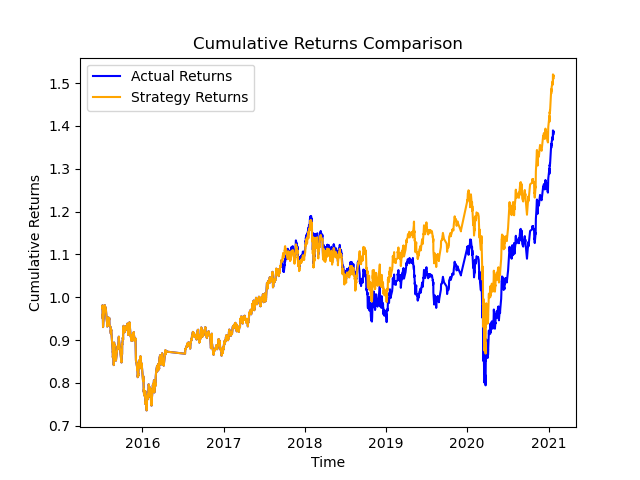
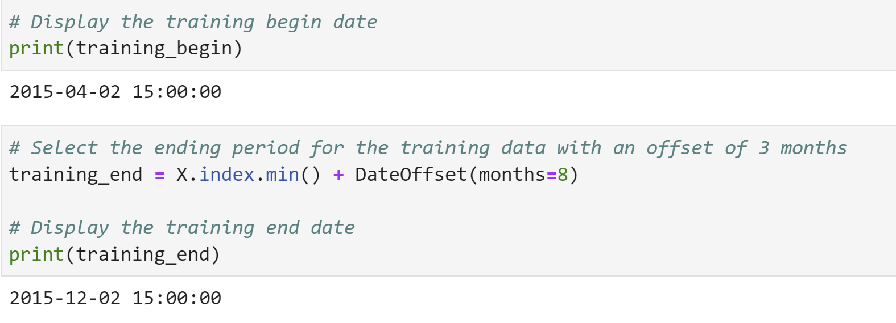
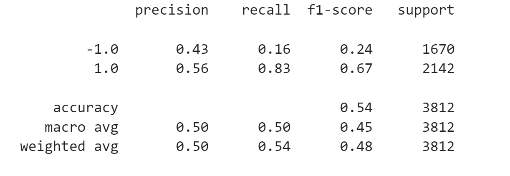
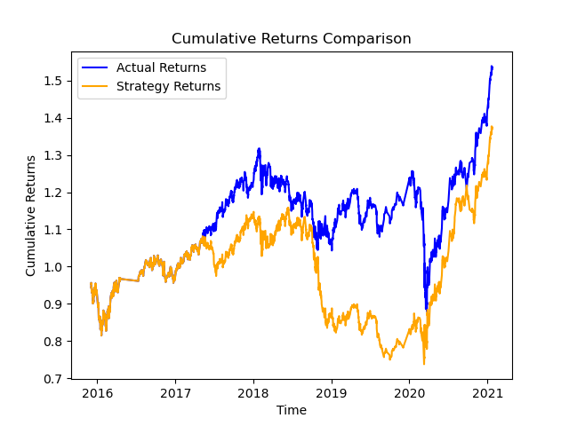
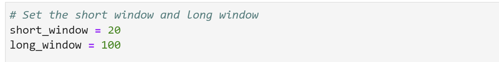
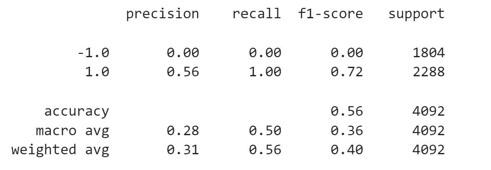
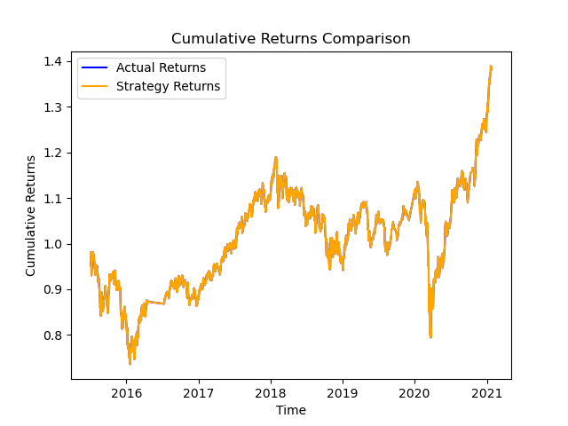

# Mastering Dynamic Trading: Integrating Machine Learning Algorithms
 
In this project, you'll use your expertise in financial Python programming and machine learning to achieve the following:
Implement an algorithmic trading strategy that leverages machine learning to automate trade decisions.
Fine-tune the input parameters of the trading algorithm for optimal performance.
Train and evaluate machine learning models to compare their effectiveness against a baseline model. Lastly, we'll generate cumulative strategy return plots to visualize and compare the performance of the models.

---

## Technologies

The technologies used in this project include:

   * Python 3.7
   * JupyterLab 3.4.4
   * Pandas 1.3.5
   * Scikit-Learn 1.0.2 
   * Matplotlib 3.5.2
  
---

## Installation Guide

Open your terminal and run the command:

```python
  pip install -r requirements.txt
```

---

## Usage

Clone the repository and Launch Jupyter Notebook by executing the following command in your terminal:

```python
  jupyter lab
```

In the Jupyter Notebook interface, navigate to the project directory and open the machine_learning_trading_bot.ipynb file.

Run each cell in the notebook sequentially to prepare the data, build the machine learning model, and evaluate the models' performance for comparison. 

The cumulative return plot of the trading algorithm serving as baseline obtained is the following:



The strategy returns outperform the actual returns until 2016. Then it starts underperforming, and it does so consistently. It indicates that your trading strategy hasn't been as successful as simply holding the asset. This suggest that our strategy needs further refinement.   

- First refinement was increasing the training window as follows:




Classification Report: 



Cumulative return plot:



Increasing the training window made the trading algorithm perform worse. One possible reason is overfitting. With a larger training window, the model might start capturing not only the genuine market trends but also short-term fluctuations, irregularities, or noise. As a result, the model might become overly sensitive to the specific historical data in the training window, leading to overfitting.

- Second tuning: Tune the trading algorithm by adjusting the SMA input features




Classification Report: 



Cumulative return plot:



Increasing the SMA short window made the trading algorithm perfom slightly better that the original. The accuracy was slightly higher, 0.56(compared to 0.55 of the original). This could be due to the longer SMA short window smoothing out short-term price fluctuations and providing a more stable trend. This could potentially help the model differentiate between actual trends and noise, resulting in more reliable signals.
 With a longer SMA window, the trading algorithm might be less sensitive to minor price movements that could lead to false signals. This could help the algorithm avoid making unnecessary trades based on short-term market fluctuations.

---


## Contributors

* Ana Martelo (anafilipamartelo@gmail.com)

---

## License

MIT